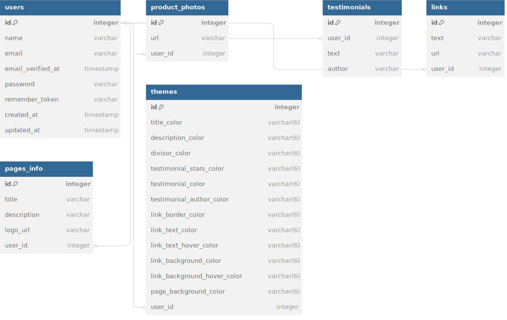

# BIO

This is an application built using Laravel where users can add links, photos of their products and testimonials. Users can customise the colours of each element on the page.

## **Table of Contents**

* [Project Overview](#project-overview)
* [Requirements](#requirements)
* [Installation](#Installation)
* [Getting Started](#getting-started)
* [Project Structure](#project-structure)
* [Dependencies](#dependencies)
* [Database Schema](#database-schema)
* [MVC Pattern](#mvc-pattern)
* [Testing](#testing)
* [Purpose of the Project](#purpose-of-the-project)
* [Contributing](#contributing)
* [License](#license)

## **Project Overview**

This Laravel project provides a foundation for building a social media links application. The project is designed to be modular and extensible, allowing you to easily add new features and functionality.

## **Requirements**

* PHP >= 8.2
* Composer
* SQLite
* Node.js and npm

## **Installation**

1. Clone the project repository:

```sh
git clone https://github.com/smlrods/bio.git
```

2. Enter the project directory:

```sh
cd bio
```

3. Install the Composer dependencies:

```sh
composer install
```

4. Install the npm dependencies:

```sh
npm install
```

5. Create a [`.env`](command:_github.copilot.openRelativePath?%5B%22.env%22%5D ".env") file from the provided [`.env.example`](command:_github.copilot.openRelativePath?%5B%22.env.example%22%5D ".env.example") file:

```sh
cp .env.example .env
```

6. Generate the application key:

```sh
php artisan key:generate
```

7. Migrate the database:

```sh
php artisan migrate
```

## **Getting Started**

1. Start the development server:

```sh
php artisan serve
```

2. Start the Vite dev server:

```sh
npm run dev
```

2. The application will be available at `http://localhost:8000`

## **Project Structure**

The project is organized into the following directories:

* [`app`](command:_github.copilot.openRelativePath?%5B%22app%22%5D "app"): This directory contains the application logic, including models, controllers, and services.
* [`config`](command:_github.copilot.openRelativePath?%5B%22config%22%5D "config"): This directory contains configuration files for the application.
* [`database`](command:_github.copilot.openRelativePath?%5B%22database%22%5D "database"): This directory contains database migrations and seeds.
* [`public`](command:_github.copilot.openRelativePath?%5B%22public%22%5D "public"): This directory contains the web server's public files, including the front-end assets.
* [`resources`](command:_github.copilot.openRelativePath?%5B%22resources%22%5D "resources"): This directory contains resources used by the application, such as views and language files.
* [`routes`](command:_github.copilot.openRelativePath?%5B%22routes%22%5D "routes"): This directory contains the routing definitions for the application.
* [`storage`](command:_github.copilot.openRelativePath?%5B%22storage%22%5D "storage"): This directory contains application storage, such as logs and uploaded files.
* [`tests`](command:_github.copilot.openRelativePath?%5B%22tests%22%5D "tests"): This directory contains unit and feature tests for the application.
* [`vendor`](command:_github.copilot.openRelativePath?%5B%22vendor%22%5D "vendor"): This directory contains third-party dependencies managed by Composer.

## **Dependencies**

This project relies on several dependencies for its functionality:

### PHP and Composer Dependencies

* **Laravel**: This is the main framework used for this project. Laravel is a web application framework with expressive, elegant syntax.

* **PHPUnit**: This is the testing framework used for writing unit tests in this project.

### JavaScript and Node.js Dependencies

* **Node.js and npm**: These are used for managing JavaScript dependencies and running tasks. Node.js is a JavaScript runtime built on Chrome's V8 JavaScript engine, and npm is the package manager for Node.js.

* **Vite**: This is a build tool that provides faster and leaner development experience for modern web projects. It is used in this project for managing and bundling the JavaScript resources.

* **Tailwind CSS**: This is a utility-first CSS framework for rapidly building custom user interfaces.

## Database Schema

[](https://dbdiagram.io/d/bio-6619988703593b6b61e0379a)

## **MVC Pattern**

The project follows the MVC (Model-View-Controller) pattern. Models represent the data of the application, controllers handle user interaction and business logic, and views render the user interface.

## **Testing**

The project includes unit and feature tests for the application logic. You can run the tests using the following command:

```sh
cp .env.testing.example .env.testing
```

```sh
npm run build
```

```sh
php artisan test
```

## **Purpose of the Project**

This project was created as a means to improve my Laravel skills. It serves as a practical application of Laravel's features and best practices. While building this bio links application, I've had the opportunity to explore various aspects of Laravel including routing, middleware, Eloquent ORM, Blade templates, and more. This hands-on experience has significantly contributed to my understanding and proficiency in Laravel.

## **Contributing**

We welcome contributions to this project.

## **License**

This project is licensed under the MIT License. Please see the LICENSE file for more information.
